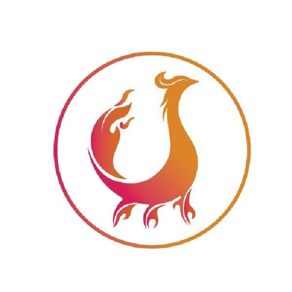

<!-- 
_paginate: false
_footer: '前端组 2025年10月30日'
_class: homePage
-->

# 关于"分享"这件事
**汇报人：哆啦润**

一个一到秋天就会主动穿上秋裤的前端崽

--- 

<!-- 
_paginate: true
-->
# 前言

对于我这个"手艺人"来说，做技术总结总是让我头痛。

我常常不清楚自己要分享什么，虽然在很多平台都有过或多或少的项目、经验分享，但每次准备分享时，都会陷入一种迷茫：

- 这个话题会不会太简单？
- 别人是不是早就知道了？
- 我讲得清楚吗？

直到我意识到：**分享不是炫技，而是一次对话。**

今天，我想聊聊我对"技术分享"的一些思考，以及我是如何用 Marp 这个工具来降低分享门槛的。

--- 
<!--
_paginate: true
_header: ''
_class: thanksPage
-->
## "技术分享"这个词似乎很苛刻

它要求：
- **分**: 每一名观众能够"分"到技术知识
- **享**: 每一名观众能够"享"受到有用的、能落地的技术知识

但实际上，技术分享可以很简单：
> 把你踩过的坑、解决的问题、学到的新知识，
> 用别人能听懂的方式讲出来。

**这就够了。**


--- 

## 由于各种原因，分享变得很复杂

> - 工作比较忙，没时间做分享 
>   _→ **可以分享工作中刚解决的问题，一举两得**_
> 
> - 准备不充分,内容质量不高 
>   _→ **先求有再求好，迭代思维**_
> 
> - 个人不自信，认为水平不够，不愿分享 
>   _→ **你的"基础"可能是别人的"新知"**_
> 
> - 对分享不感兴趣或不认可，只想安安静静敲代码 
>   _→ **试试看，分享能让你写得更好**_

---
<!--
_paginate: true
_header: ''
_class: thanksPage
-->
## 更深层的原因

> - 没有坚持到底，导致分享会开展不下去 
>   _→ **降低频率，保证质量，而非追求数量**_
> 
> - 没有内容分享，导致分享会开展不下去 
>   _→ **日常工作就是最好的素材库**_
> 
> - 把分享当成工作形式，水内容，逐渐不了了之 
>   _→ **分享是投资，不是任务**_

核心问题是：**我们把分享想得太重了。**

--- 

## 对个人的价值

1. **梳理知识体系**  
   讲一遍 = 学三遍，输出倒逼输入

2. **建立个人品牌**  
   持续分享让你在团队中更有影响力

3. **提升表达能力**  
   技术再好，说不清楚也白搭

4. **深化理解**  
   准备分享的过程，会发现很多"以为懂了其实没懂"的点

---
<!--
_paginate: true
_header: ''
_class: thanksPage
-->
## 对团队的价值

1. **知识沉淀与传承**  
   避免重复踩坑，缩短新人成长周期

2. **提升团队整体水平**  
   一个人进步 → 团队进步 → 项目质量提升

3. **营造学习氛围**  
   有人分享 → 更多人愿意分享 → 正向循环

4. **促进技术交流**  
   打破信息孤岛,让好的实践快速扩散

**分享不是单向输出，而是双向成长。**

--- 
<!--
_paginate: true
_header: ''
_class: thanksPage
-->
## 分享的本质

分享不是：
- ❌ 展示自己多厉害
- ❌ 讲一个完美无缺的方案
- ❌ 必须高大上、有深度

分享是：
- ✅ 传递一个有用的信息
- ✅ 帮助别人少走弯路
- ✅ 引发一次有价值的讨论

**好的分享，是让听众有收获，而不是让自己显得很厉害。**

---
<!--
_paginate: true
_header: ''
_class: thanksPage
-->
## 我的分享方法论

### 1. 选题：从实际问题出发
- 最近解决的 Bug
- 引入的新技术/工具
- 踩过的性能坑
- 读源码的收获

**原则：能帮到至少一个人，就是好选题。**

---
<!--
_paginate: true
_header: ''
_class: thanksPage
-->
### 2. 结构：讲清楚三件事

```
背景 → 问题 → 解决方案
```

展开版：
1. **背景**: 为什么会遇到这个问题
2. **问题**: 问题的具体表现和影响
3. **分析**: 定位问题的思路
4. **方案**: 如何解决的（可能有多种方案）
5. **总结**: 可复用的经验/原则

**这个结构适用于 80% 的技术分享。**

---
<!--
_paginate: true
_header: ''
_class: thanksPage
-->
### 3. 内容：讲人话，用例子

- **讲人话**: 少用术语，多用类比
  - ❌ "这里用了观察者模式实现发布订阅"
  - ✅ "就像订阅公众号，有新文章就通知你"

- **用例子**: 抽象概念配具体代码
  - ❌ "闭包可以保持变量引用"
  - ✅ "看这段代码，定时器里为什么能访问到外面的变量？"

- **画图**: 一图胜千言
  - 架构图、流程图、对比图

--- 
<!--
_paginate: true
_header: ''
_class: thanksPage
-->
## 快速上手的小技巧

1. **从 5 分钟小分享开始**  
   站会上分享一个小技巧，降低心理门槛

2. **复用工作成果**  
   Code Review 的内容、技术方案文档，稍作整理就能分享

3. **结对分享**  
   和同事一起准备,降低压力,互相补充

4. **定期回顾**  
   每月盘点一次，这个月学到了什么，可以分享

**关键是开始,而不是完美。**

--- 
<!--
_paginate: true
_header: ''
_class: thanksPage
-->
## 为什么我选择 Marp

传统 PPT 工具的痛点：
- 排版耗时，调格式比写内容还费劲
- 版本管理困难，改了就覆盖了
- 不便协作，文件传来传去
- 样式不统一，每次都要重新调

**Marp 的优势：**
- ✅ Markdown 写作，专注内容
- ✅ Git 版本控制，可追溯可协作
- ✅ 主题复用，一次配置处处使用
- ✅ 导出 PDF/HTML，方便分享

---

## 其他推荐工具

| 工具                | 用途         | 推荐理由                      |
| ------------------- | ------------ | ----------------------------- |
| **Excalidraw**      | 手绘风格图表 | 快速画架构图、流程图          |
| **Carbon**          | 代码截图美化 | 让代码片段更美观              |
| **Notion/飞书文档** | 大纲整理     | 先列大纲，再填内容            |
| **ScreenToGif**     | 录制操作     | 演示操作步骤比截图清楚        |
| **Slidev**          | 开发者 PPT   | 比 Marp 更强大，支持 Vue 组件 |

---

## 我的工作流

```
1. 文档列大纲
   ↓
2. Marp 写 Markdown
   ↓
3. Excalidraw 画图 → 插入 PPT
   ↓
4. 导出 PDF 分享
   ↓
5. 内容整理成博客文档
```

**核心思路：用最简单的工具,做最高效的分享。**

---


<!--
_paginate: true
_header: ''
_class: thanksPage
-->
## 关键要点回顾

1. **分享不难**  
   从工作中的小问题开始，不求完美，先求有

2. **结构简单**  
   背景 → 问题 → 方案，讲清楚这三件事就够

3. **工具辅助**  
   Marp + Markdown，让你专注内容而非排版

4. **持续迭代**  
   每次分享都是一次练习，会越来越好

**最重要的：今天就开始，而不是等"准备好"。**

---

## 给大家的行动建议

**记住：你的分享，一定能帮到某个人。**

---

<!--
_paginate: false
_header: ''
_footer: 陈润&emsp;2025年10月30日&emsp;Thank you for your time and attention.
_class: thanksPage
-->

## 感谢倾听

### 欢迎交流讨论 🎉

> "The best time to start was yesterday.  
> The next best time is now."

---

## 附录：参考资料

- **Marp 官方文档**: https://marpit.marp.app/
- **Markdown 语法**: https://www.markdownguide.org/
